# Steps to Enable Backups and Revert Azure VMs, Databases (DBs), and Blobs for Bold BI backup compatibility 

## 1. Create a Linux Virtual Machine (VM)

Begin by creating a Linux virtual machine. For detailed instructions, refer to the link: [Quick Create Portal](https://learn.microsoft.com/en-us/azure/virtual-machines/linux/quick-create-portal?tabs=ubuntu).

## 2. Connect to the Linux VM from your Computer

Establish a connection to the Linux VM from your local computer:
  - Open Windows Powershell or Treminal.
  - Type the following commedend in Powershell or Treminal,"ssh your-username@your-vm-ipaddress".Ex (ssh example@0.0.0.0).

## 3. Setting Up an Azure Database for PostgreSQL

To install PostgreSQL on Linux, you can use the package manager specific to your distribution. Here are the commands for some common distributions:
1. **Ubuntu/Debian**:
   ```bash
   sudo apt update
   sudo apt install postgresql postgresql-contrib
2. **CentOS/RHEL**:
    ```bash
    sudo yum install postgresql-server postgresql-contrib
    sudo postgresql-setup initdb
    sudo systemctl start postgresql
    sudo systemctl enable postgresql
                ---OR---
To set up a PostgreSQL database on Azure with the desired configurations, follow these detailed steps:

- Click on "+create a resource", navigate to the services list, select "Database", and then choose the PostgreSQL database option.

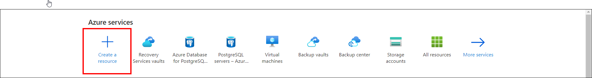
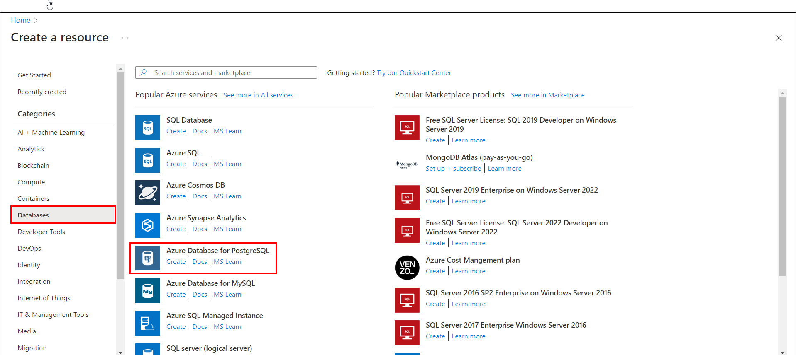
- Proceed to enter the required information to establish your Database:
   - In the basic settings, select your subscription, pick an existing resource group or make a new one, input a name for your PostgreSQL server, and select a region.
   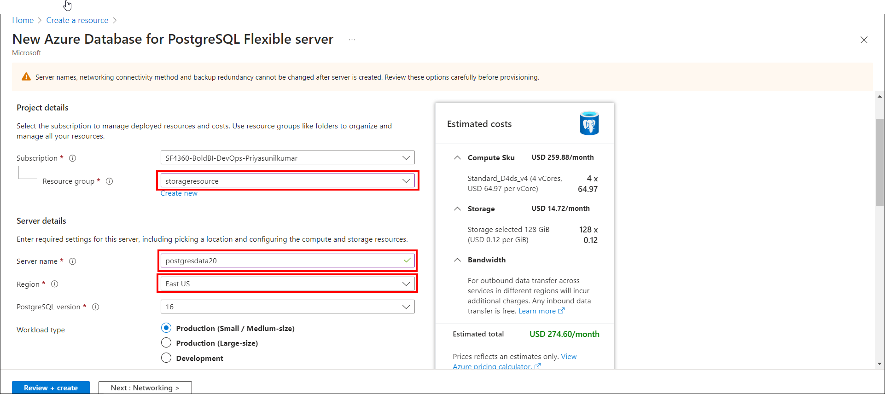
   
   - For server settings, select a pricing tier (such as Basic, General Purpose, or Memory Optimized), choose a PostgreSQL version, and create a username and password for the server admin. In the compute + storage section, activate the option for geo-redundancy.
   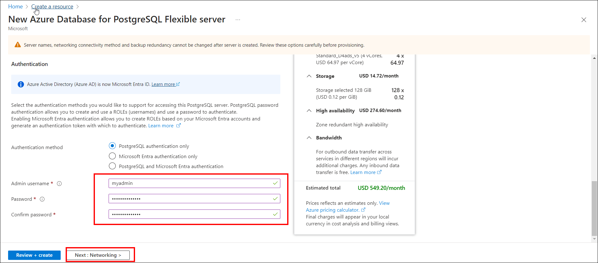
   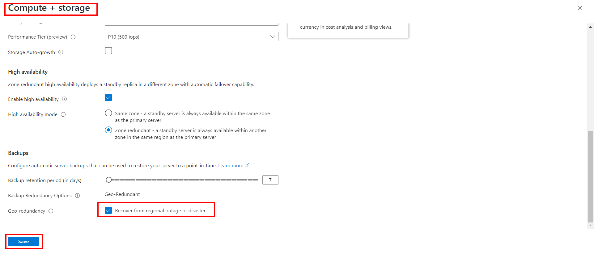
   - In the networking section, select your preferred connectivity method (like public or private endpoint), set up firewall rules, and ensure the box is checked to permit server access. Afterward, click the "Review and create" button.
   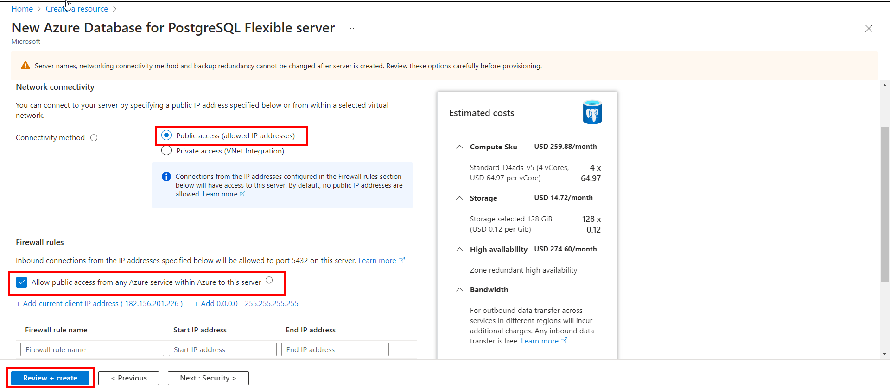
   - Use the server name, username, and password you chose during setup to connect to your new database.
   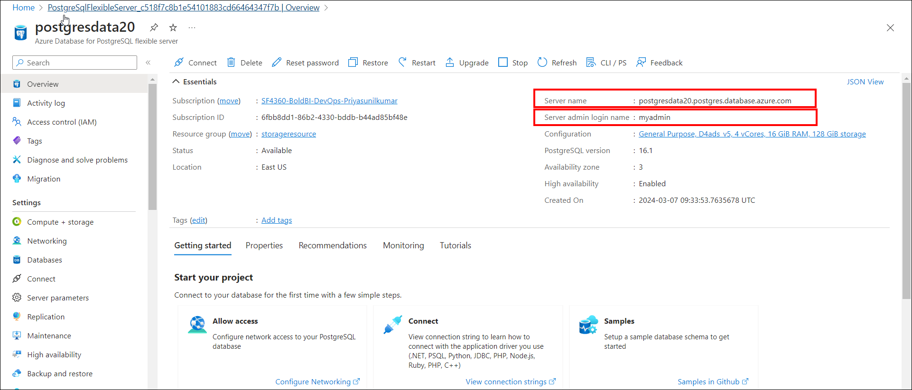
- For further guidance, you can refer to the following link: [Quickstart: Create an Azure Database for PostgreSQL server in the Azure portal](https://learn.microsoft.com/en-us/azure/postgresql/flexible-server/quickstart-create-server-portal)

## 4. Create a Storage Account on Azure

Follow these steps to create a storage account on Azure:

-  Click on "Create a resource" in the Azure portal, then search for "Storage account" and select it.

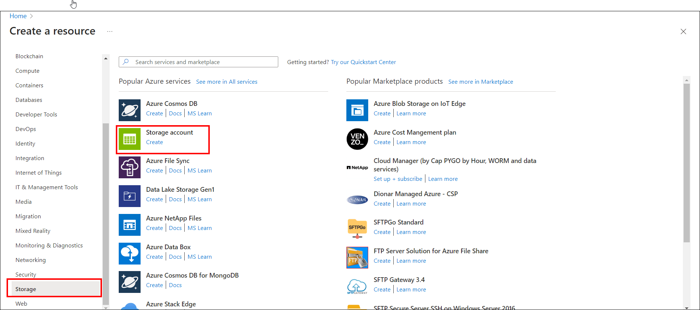
- Configure the basic settings:
   - Select a subscription.
   - Choose a resource group or create a new one.
   - Enter a name for the storage account.
   - Choose a location for the storage account.
   - Select the storage performance as standard and redundancy as Geo-redundant storage (GRS).
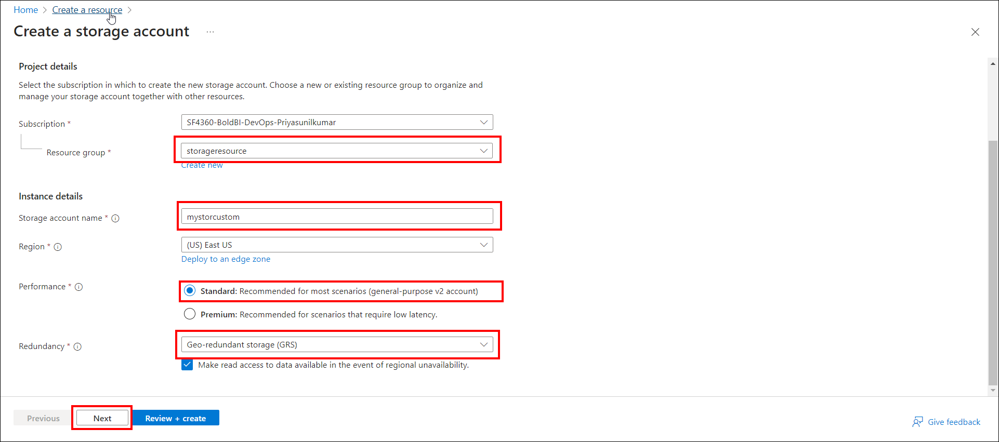

- In the Advanced tab, click the checkbox to allow cross-tenant replication. Click on "Review" once it is validated, then click on "Create" to create the storage account.
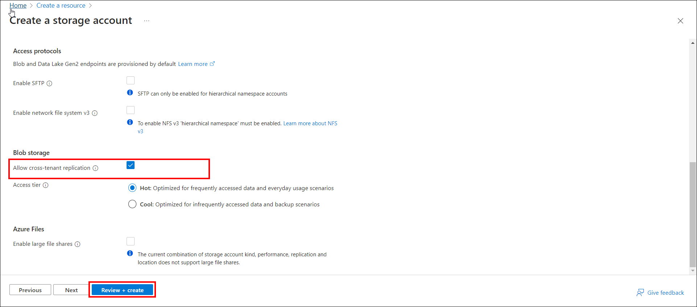

- To create a blob container in Azure, follow these steps:
   - Navigate to your storage account.
   - In the left menu, scroll down to the Data storage section and select Containers.
   - Click the + Container button.
   - Provide a name for your new container. Remember that the container name must be lowercase, start with a letter or number, and can include only letters, numbers, and the dash (-) character. The name should also be between 3 and 63 characters long.
   - Set the Anonymous access level for the container (recommended: Private).
   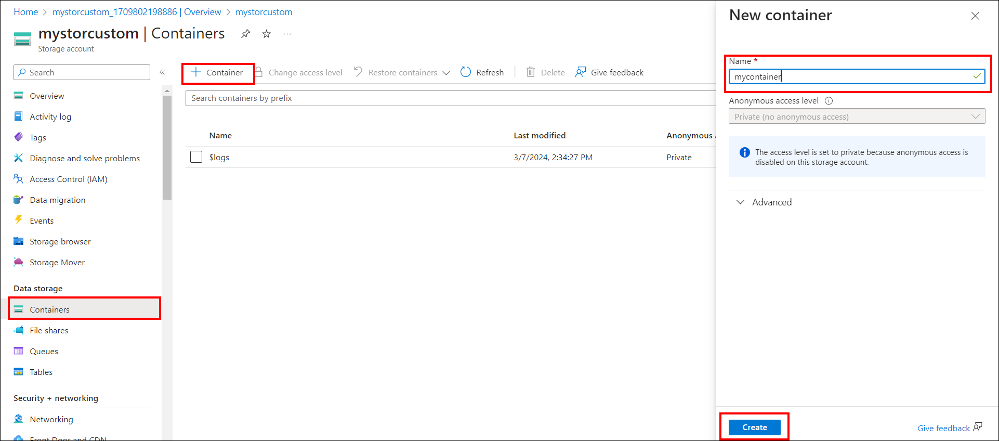

- For detailed instructions, you can refer to the following link: [Create an Azure storage account](https://learn.microsoft.com/en-us/azure/storage/common/storage-account-create?tabs=azure-portal)


## 4. Bold BI Installation

- Features to be enabled in IIS to run Bold BI in Windows Server OS. Refer to [Bold BI documentation](https://help.boldbi.com/deploying-bold-bi/deploying-in-windows/installation-and-deployment/).
- You have the option to download various versions of Bold BI from [here](https://www.boldbi.com/account/downloads). you can download 
- Follow the steps in the [documentation](https://help.boldbi.com/deploying-bold-bi/deploying-in-windows/installation-and-deployment/) to install the BoldBI web application.
- For guidance on startup configuration for Bold BI, please refer to the following link: [Help.BoldBI.com](https://help.boldbi.com/application-startup/latest/)


## 5. Create a Snapshot of Virtual Machine

- Navigate to the Disk in Windows VM and click the disk.
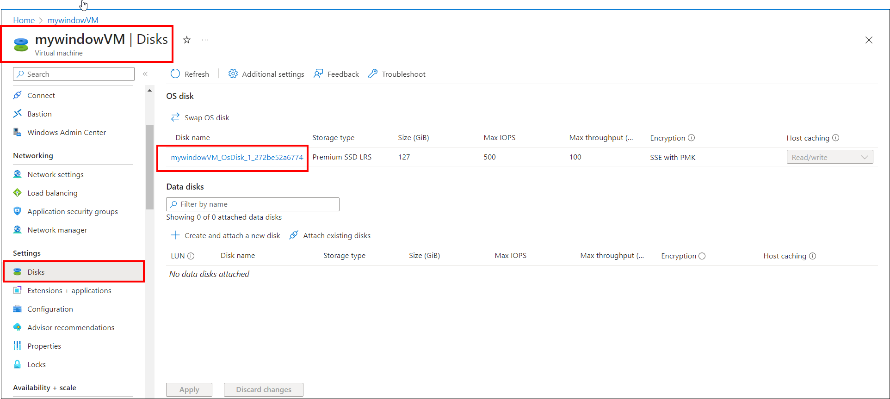
- Click on '+ Create snapshot' in the disk settings to create a snapshot of your Virtual Machine.
- Enter the Snapshot name and change the snapshot type to full or incremental.
- Click on 'Review and create' button.
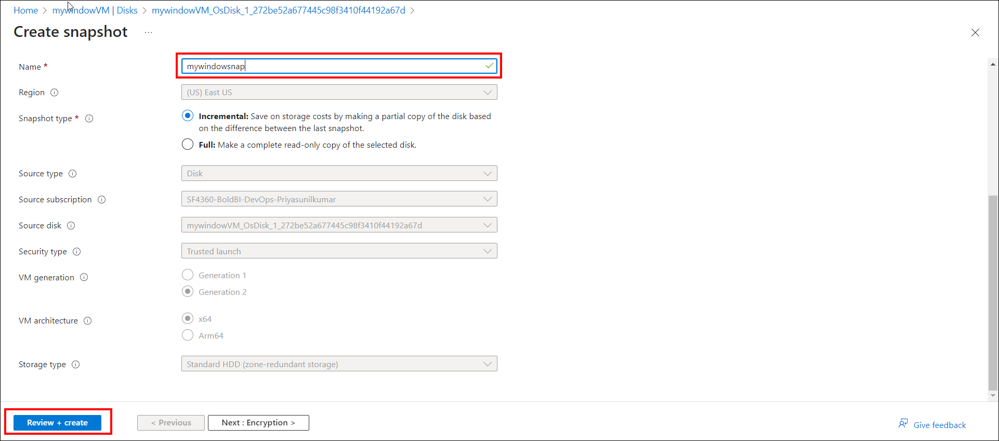
- Creating a virtual machine (VM) from a snapshot is similar to creating a normal VM, with the main difference being that you start from an existing snapshot instead of a blank VM template. Here are the steps to follow:
  - Click on the "+Create VM" button.
  - Enter the name of the VM and select the desired storage size.
  - Allow ports HTTP, HTTPS, and RDP in the inbound rules of the VM's network security group.Select the license type as "Windows Server" when prompted.

## 6.PostgreSQL Backup and Restore in Azure

- Create a PostgreSQL Backup
  - To learn how to back up a PostgreSQL database in Azure, visit: [Backup Azure Database for PostgreSQL](https://learn.microsoft.com/en-us/azure/backup/backup-azure-database-postgresql-flex).

- Restore a PostgreSQL Database
  - For instructions on restoring a PostgreSQL database in Azure, visit: [Restore Azure Database for PostgreSQL](https://learn.microsoft.com/en-us/azure/backup/restore-azure-database-postgresql-flex).

- Steps to Create a Restored PostgreSQL Database
  - Go to your original database and click on "Restore" found on the left pane. 
  - For "Point-in-time-restore," select "Select a custom restore point." Enter your Server name and proceed by clicking on "review and create." After the restoration process, verify that all data from the original database is present in the restored database.
  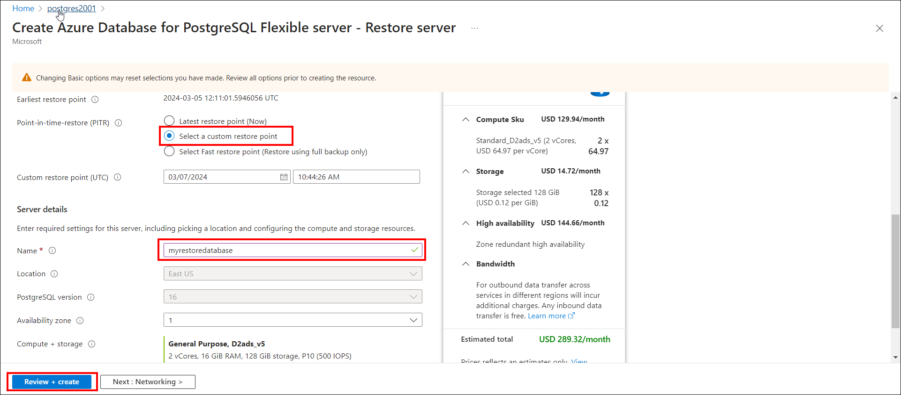

- Using the Restored Database
  - To use the restored database, you'll need to reset the database on your Virtual Machine. Detailed steps can be found in the following documentation: [Reset Application Database on Windows](https://help.boldbi.com/utilities/bold-bi-command-line-tools/reset-application-database/#windows)

